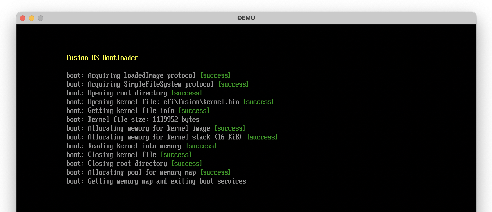
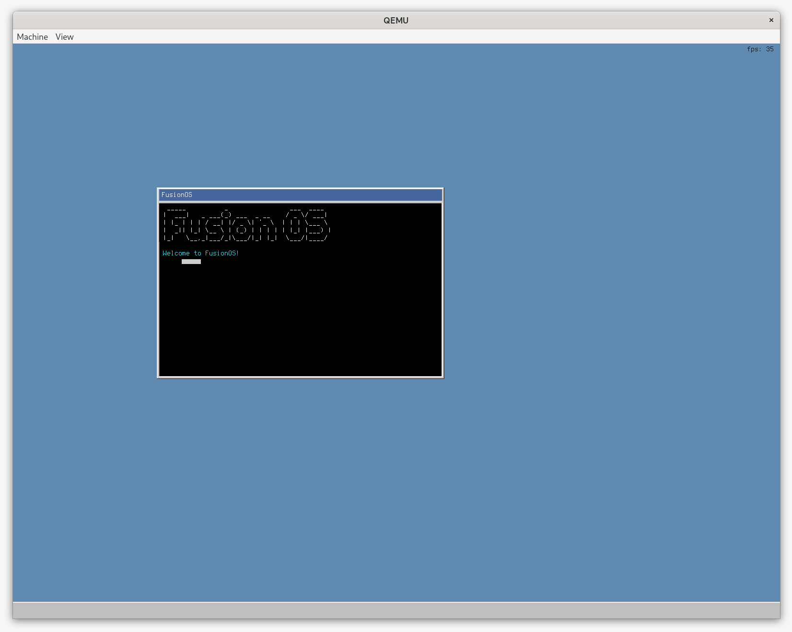
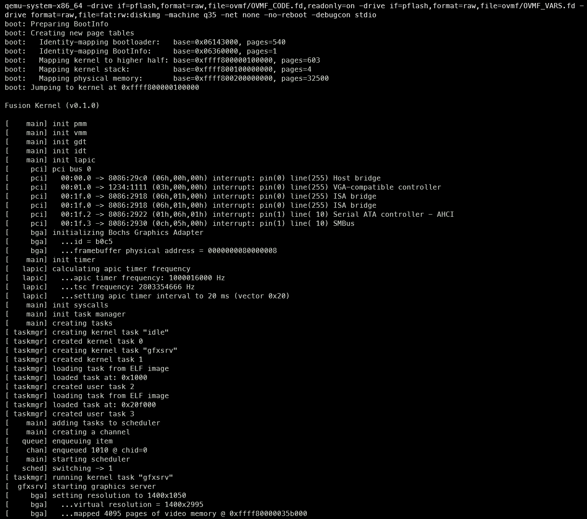

# Fusion OS


Fusion is a hobby operating system for x86-64 implemented in Nim. I'm documenting
the process of building it at: [https://0xc0ffee.netlify.app](https://0xc0ffee.netlify.app).

## Screenshots

**UEFI Bootloader**



**GUI** (_Note: This screenshot is from the `graphics` branch, which is still a work-in-progress._)



**Booting and Running the Kernel**



## Features

The following features are currently implemented:

- UEFI Bootloader
- Physical Memory Manager
- Virtual Memory Manager
- Single Address Space
- User Mode
- Preemptive Multitasking
- System Calls
- ELF Loader
- Timer Interrupts
- Channel-based Inter-Process Communication

Planned:

- Demand Paging
- Disk I/O
- File System
- Keyboard/Mouse Input
- Shell
- GUI
- Networking

## Building

To build Fusion, you need to have the following dependencies installed:

- [Nim](https://nim-lang.org)
- [LLVM](https://llvm.org) (clang and lld)
- [Just](https://github.com/casey/just)

Build Fusion with the following command:

```sh
just build
```

## Running

Fusion currently runs on [QEMU](https://www.qemu.org), so you'll need to install it first. Launch Fusion with the following command:

```sh
just run
```

## License

MIT
